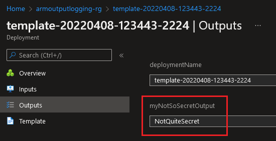
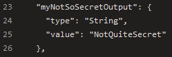
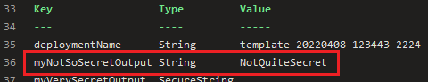
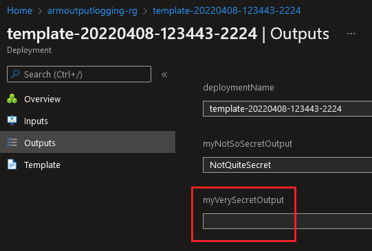
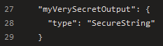
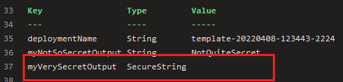

# Azure Resource Manager output logging

This repository illustrates why you should not return a secret as an ARM output. To return a secret you have two options: either use the `string` type or the `securestring` type. I created a JSON ARM template that is having two secret outputs:

- `myNotSoSecretOutput` as a `string`
- `myVerySecretOutput` as a `securestring`

I'm using a JSON ARM template and Azure DevOps for this demonstration but the result would be the same with Bicep and GitHub Actions.

## Output as a string

The secret will be logged in the Azure Portal:

As Azure DevOps is not aware it's a secret, it will not attempt to obfuscate it in the logs. Below I'm logging the output from the `AzureResourceGroupDeployment` task:

The same result can be observed when retrieving the deployment outputs using the `Get-AzResourceGroupDeployment` `cmdlet`:

## Output as a securestring

In this situation, the secret is so secret it cannot be retrieved!

It will appear as blank in the Azure portal, copying the value will copy `undefined` to the clipboard:

The output returned by the `AzureResourceGroupDeployment` task does not have a `value` property:

The output returned by the `Get-AzResourceGroupDeployment` `cmdlet` has a `$null` value:

## Conclusion

Secrets should not be returned as ARM template outputs. When returned as `string`, they're logged as plain text. When returned as `securestring` (which intuitively seems like the right thing to do), their value is not returned at all.

If you need to use the secret in a script, consider creating a Key Vault secret in the ARM template and retrieving the secret value from the script. If you need to use the secret in another template, consider using the [existing][bicep-existing] keyword in Bicep.

[bicep-existing]: https://docs.microsoft.com/en-us/azure/azure-resource-manager/bicep/existing-resource
